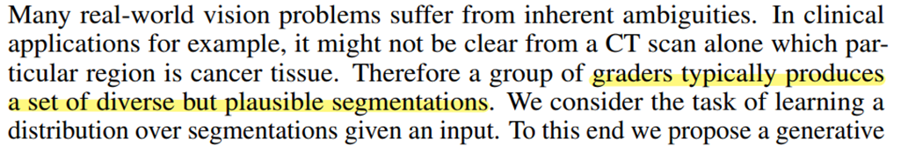

## 실제 환경에서의 segmentation?

어떤 환자가 CT를 촬영했는데 특정 병변이 발견되었다고 하자. 의사들은 병변을 보고 환자의 질병의 소견을 내릴 수 있다. 이 때 의사들이 보는 중요한 혹은 실제로 병변이라고 생각하는 영역들이 완전히 동일할까? 그렇지 않다. 논문을 살펴봐도 같은 이야기를 하고 있는 것을 볼 수 있다.

실제로 아래와 같이 grader들이 한 병변을 보고 뽑아낸 annotation 결과가 다 다르다.

기존의 U-Net 기반의 segmentation 논문은 오직 pixel 단위의 probabilities를 제공해 주는데, 이는 픽셀 간의 공분산을 고려하지 못한다. 따라서 항상 deterministic한 결과를 뽑아내게 되는 것이다. 

### 구조

구조는 다음과 같다. `U-Net` 부분만 보면 크게 달라진 것은 없는데 최종적으로 inference에서 결과를 뽑아내는 과정을 sampling 과정이라고 정의하고 있따.(a) Training 과정은 (b)에서 이루어진다. 그리고 `Prior Net`과 `Posterior Net`을 이용하여 Latent space를 학습하고, 이를 이용하여 segmentation map을 추출하게 되는데 이것이 논문에서 가장 큰 특징이 아닐까 싶다. 지금 이용하는 네트워크들이 Conditional Variational Auto Encoder(CVAE)이다.

### Background

본격적인 구조 설명에 앞서서 필요한 개념들을 보고 넘어가려고 한다. 수식이 많은데, 다 설명하지는 않고, 간단하게 보고 넘어가고자 한다.

#### KL divergence

하나의 확률분포로부터, 다른 하나의 확률 분포가 얼마나 다른지를 정량화하는 방법이라고 보면 된다. Ground truth distribution P(x)가 있을 때, approximate distribution Q(x)를 추정하고자 할 때 사용할 수 있다. 수식은 아래와 같다.

저자들이 제공해주는 코드를 봐도, 위의 구조만 봐도 KL divergence가 잘 사용되고 있음을 볼 수 있다.

#### VAE

아키텍쳐를 먼저 살펴보자

Encoder를 통해 input을 latent space로 압축하고, 이를 decoder를 통해서 복원하는 과정을 통해 진행된다. 기존의 autoecoder와 다른 점은 encoder에서 평균과 분산을 추출한 다음, 미분가능하기 만들기 위해 평균과 분산이 0과 1인 정규분포를 갖는 영역에서 sampling하여 이를 함께 이용한다는 것이다. (`Reparameterization Trick`) 

우측 위의 수식을 보면, p_theta(x)를 우리는 알지 못한다(intractable). z가 주어졌을 때 x의 확률분포를 모든 z에서 뽑아낼 수 없기 때문이다.(빨간 사각형 부분) 거기에다가 이를 풀어보려고 z가 주어졌을 때 확률 분포에 관한 식으로 만들어도 결국 x의 확률 분포를 알아야 한다. 

이를 근사하기 위해서 encoder를 함께 사용하는 것이다. q는 p를 근사하기 위한 neural net이라고 보면 된다. 아래 수식을 전개하다 보면 결국 ce loss와 kl divergence만 계산하면 되는 결과가 나오게 되어, 우리가 알고자 하는 수식의 근사치를 구할 수 있게 된다. 

### 학습 과정

- Sampling process

  - 낮은 차원의 잠재 공간에서 sampling한다. (N=6)
  - 각각의 위치에서 segmentation variant를 인코딩한다. `Prior Net`은 weight w를 통해 파라미터화하고, 주어진 입력 이미지 x에 대한 확률을 추정하게 된다.

  

  - 동일한 이미지에 대해서 m번 반복하여 m개의 segmentation map을 추출한다.
  - 최종적으로 U-Net의 마지막 activation map에 concat한다.

  

- Training Process

  - CVAE의 training 절차에 따라서 training된다. 앞에서 본 수식을 이용한다.
  - 기존의 training 방식과 가장 큰 차이는 training process가 추가적으로 latent space 안에서 segmentation variants의 유용한 embedding을 추가로 찾아야 한다는 점이다. 이를 `posterior net`을 통해서 찾는다. 이미지 x와 segmentation gt y를 이용한다. 
  - `Posterior Net`을 통해 추출한 평균과 분산을 통해 만들어진 latent space와 `Prior Net`을 통해 추출한 평균과 분산을 통해 만들어진 latent space 간의 kl divergence를 통해 mapping이 학습이 된다.

  

  - `Posterior Net`의 latent space에서 samplig된 z는 inference process에서처럼 U-Net 뒤에 붙어서 예측된 segmentation map이 만들어지고, ce loss를 통해 계산된다.
  - 전체 loss function

  

### 평가

#### 평가지표

는 IoU를 사용하지만, segmentation들 간에 분포에 관심이 있기 때문에 관측 값들 사이의 거리를 활용하는 GED(Generalized Energy Distance)를 사용한다. (d(x,y) = 1 - IoU(x,y))

#### 데이터셋

#### 비교모델 및 실험 결과 

